# 3d-scanner

ESP32-S3 VL53L7CX turntable scanner firmware and raw-scan replay tools.

## Contents

- `firmware/esp32s3_vl53l7cx_model_server/esp32s3_vl53l7cx_model_server.ino`
  - ESP32-S3 web UI and scanner firmware.
  - Supports raw-hit point cloud, calibrated visual hull, no-background envelope estimation, and raw debug export.
- `tools/simulate_calibration_first_replay.py`
  - Replays exported `vl53l7cx_raw_scan*.jsonl` files.
  - Supports calibrated background subtraction and no-background raw-envelope estimation.
- `tools/analyze_raw_scan_log.py`
  - Utility for inspecting raw scan/debug logs.

## Recommended Scan Flow

1. Open the ESP32 web UI.
2. Use `perpendicular` distance projection.
3. For best geometry, run `空掃校正一圈` before scanning the object.
4. If no background scan is available, use raw-hit/no-bg output only as an estimated result.

## Replay Examples

Calibrated replay:

```bash
python tools/simulate_calibration_first_replay.py \
  --empty vl53l7cx_raw_scan-empty.jsonl \
  --object vl53l7cx_raw_scan-object.jsonl \
  --distance-model perpendicular
```

No-background replay:

```bash
python tools/simulate_calibration_first_replay.py \
  --no-bg \
  --object vl53l7cx_raw_scan-object.jsonl \
  --distance-model perpendicular \
  --ply-output models/vl53l7cx_scan8_no_bg_rect_round_estimate.ply
```

Raw scan logs are intentionally ignored by git. Curated README images under `docs/images/` and exported models under `models/` are tracked.

## Model Files

- `models/vl53l7cx_scan8_no_bg_rect_round_estimate.ply`
  - 3D surface point-cloud export from the replay tool.
  - Generated from `vl53l7cx_raw_scan-8.jsonl` in no-background mode.
  - Estimate from raw data: `29.28 x 44.61 mm`, 720 points.
  - This is useful for viewer/testing, but calibrated empty-scan data is still the better source for trusted dimensions.

## Image Gallery

These images are generated from replay/debug runs and are included for README inspection. Raw `.jsonl` scan logs are not included.

### Calibration And Visual Hull

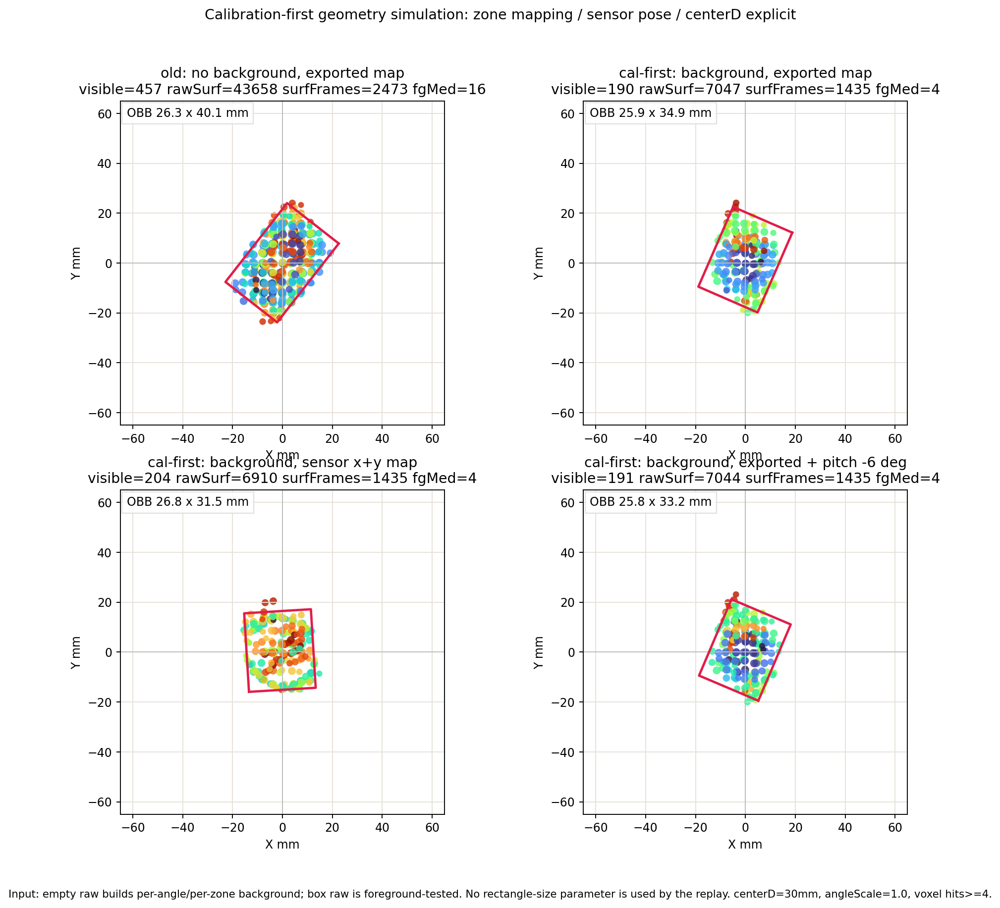

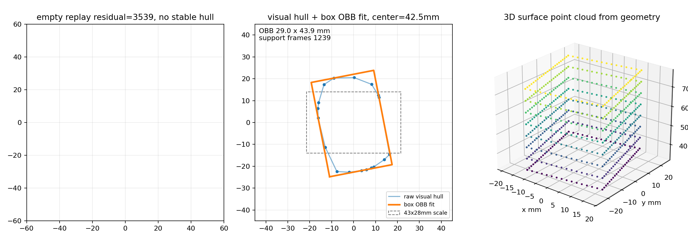

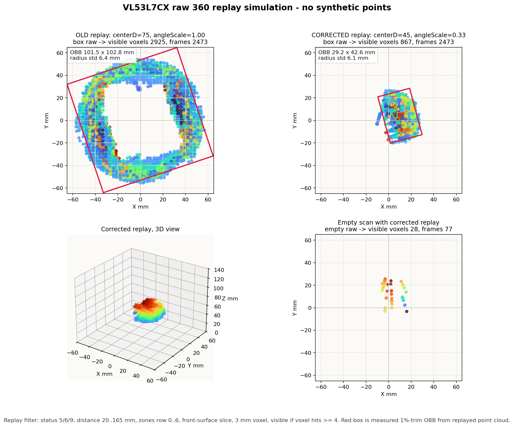

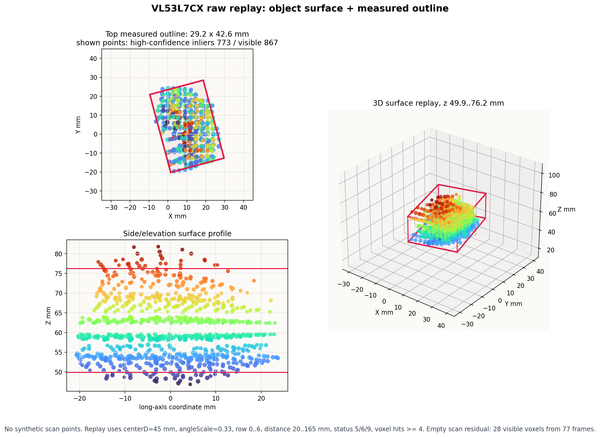

### Raw Scan Diagnostics

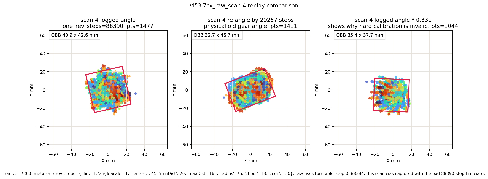

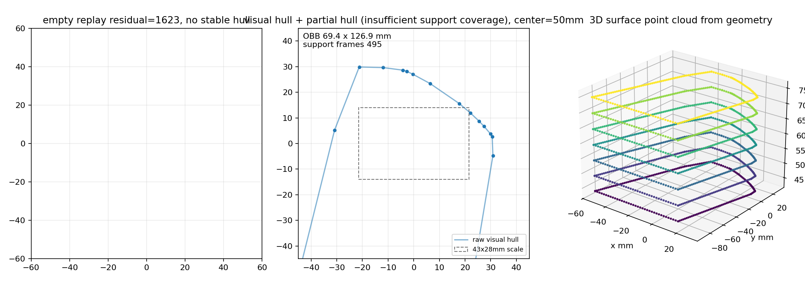

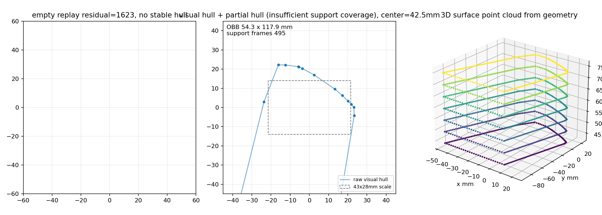

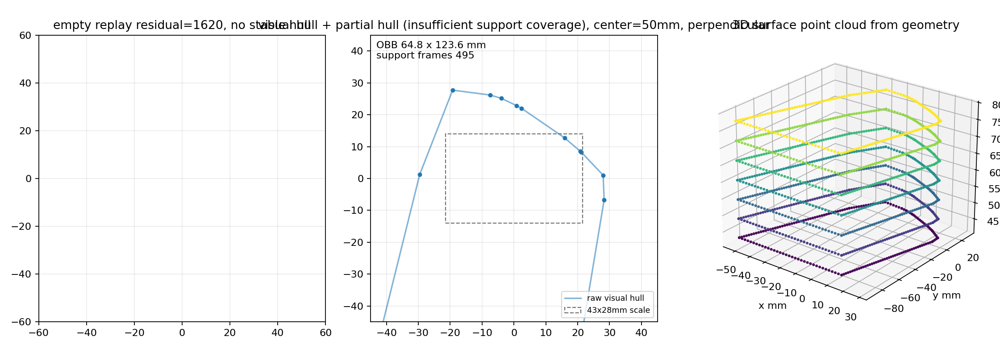


### No-Background Diagnostics

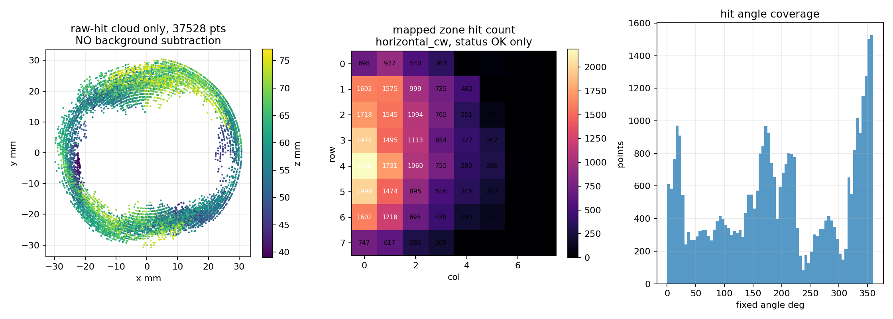

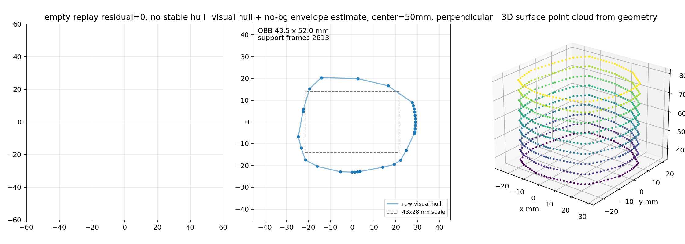

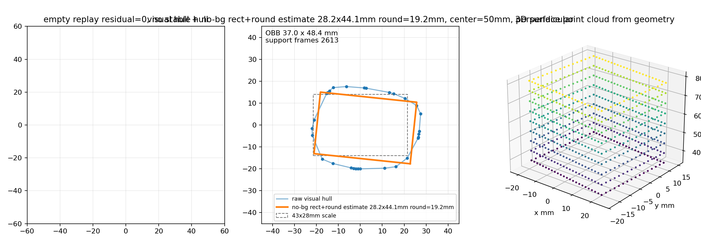

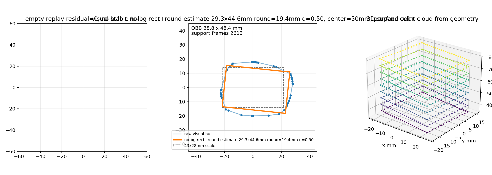
